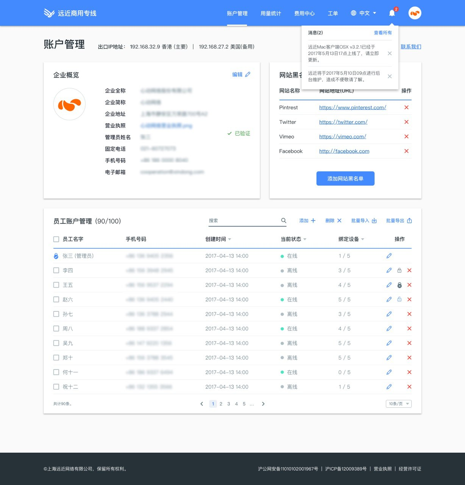

@title[远近商用专线]
## 商用专有互联加速业务
##### 一套完整的商用私有互联网加速解决方案

---

@title[概述]

## Web可视化管理界面

+++

- 管理人员账号
— 精细管控每个登陆终端|
- 使用行为监控，感知用户访问敏感内容|
- 访问控制：全局或用户|
- 可视化用量统计|

---

## 全平台终端App

+++

##### PC电脑端

> 将智能加速路由下沉到个人PC，上网办公更流畅

- OS X v10.1 及更新的操作系统
- 支持Windows XP及更新的操作系统

+++

##### 移动终端

> 移动办公更便捷

+++

- 支持IOS v9.0及更新的操作系统
- 支持Android v4.4及更新的操作系统

---

# 谢谢